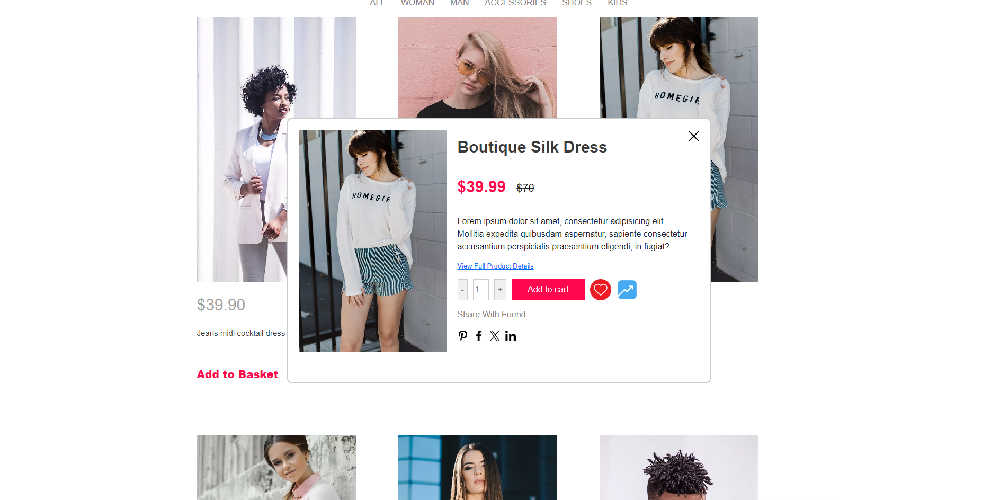

## Available Scripts

HTML/CSS/JAVASCRIPT/REACT JS/TYPE SCRIPT

# Internet Shop Magazine




This is a simple internet magazine project for an online shop. It provides various pages for users to browse products, view product details, add items to their cart, and complete the checkout process.

## Pages

- **Home**: The landing page of the website.
- **Shop**: Browse different categories of products.
- **Product Details**: View detailed information about a specific product.
- **Cart**: View and manage items in the shopping cart.
- **Checkout**: Complete the purchase process.
- **Dresses**: Browse dresses category.
- **Shoes**: Browse shoes category.
- **Contact**: Contact page for customer inquiries.

## Features

- **Product Browsing**: Users can browse different categories of products.
- **Product Details**: Detailed information about each product.
- **Shopping Cart**: Users can add and remove items from their shopping cart.
- **Checkout Process**: Seamless checkout process for users to complete purchases.
- **Contact Form**: Contact form for users to reach out with inquiries.

## Installation

1. Clone the repository:

   ```bash
   git clone https://github.com/your-username/internet-shop-magazine.git

2.   npm install

3.   npm start

   Runs the app in the development mode
    Open [http://localhost:3000]